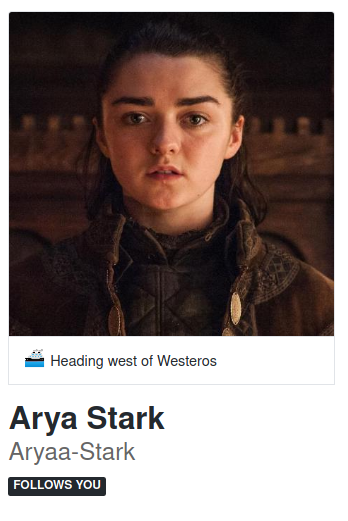
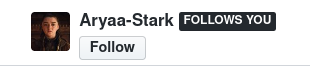

  
  <h3>
    Follows You
  </h3>
  
GitHub :octocat: Browser Extension

  

# Follows You on GitHub

_Follows You_ shows a label on a GitHub follower profile 👨🏻‍💻

## Simple just like that

  
   
  

